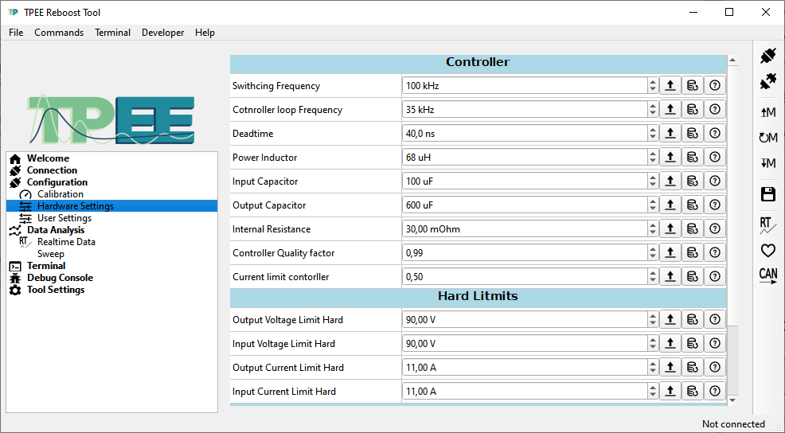
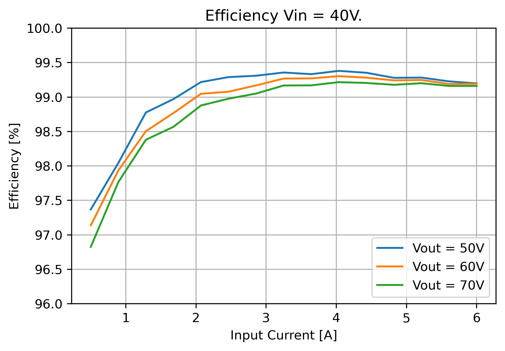
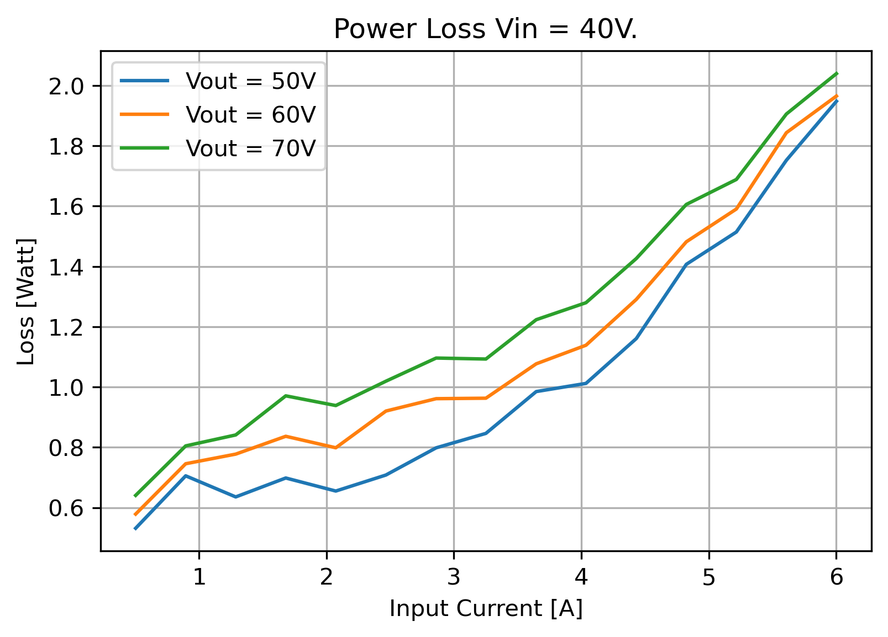

# Open Smart Energy Converter #
Open-SEC is an open-source digital DC-DC converter that is designed to function as Maximum Power Point Tracker (MPPT) in solar-powered race cars. The development started in 2018 based on open-source MPPT hardware. After coming across some hardware limitations, it was quickly decided to develop new hardware based on the emerging Gallium-Nitride (GaN) switches, that made a design possible that is highly efficient and lightweight: only 0.5% of the energy is lost due to heat, and the weight was halved compared to existing solutions. 

One of the goals of making this project open-source is to make high-end components more accessible to the many awesome teams that join for the [world solar challenge](https://www.worldsolarchallenge.org/) in Australia, and even similar projects that students and companies alike venture in. Hopefully extending the use of smart power conversion. With that, bringing a sustainable future one step closer.

The project is fully developed by TPEE. Visit [tpee.nl](https://www.tpee.nl) for more information and to get in touch.

# Getting started #

This repository contains the main firmware. Alongside this repository, there are to more repositories:

* [ReboostTool](https://github.com/TjitteS/ReboostTool): Configuration tool.
* [ReboostV2 Hardware](https://github.com/TjitteS/ReboostV2-Hardware): Hardware repository.

The minimum tools required to build an Open-SEC are:
* Assembled hardware
* A tool for flashing STM32 microcontroller, like ST-link
* [TAG-Connect](https://www.tag-connect.com/debugger-cable-selection-installation-instructions/st-link-v2) programming cable

The firmware is written in C and is built using the STM32CubeIDE environment. in the environment, two build configurations are defined: Debug and Simulation. the simulation build configuration is used to test firmware. In this build, a simulator is added in instead of the real hardware power electronics. This way it can simulate the control algorithm and other things, without having the risk of destroying the hardware. When enough confidence is built up during testing, the Debug configuration is used to turn the real thing on. Fingers crossed and hope the simulator was accurate enough!

After uploading the (stable) firmware, using an ST-link with tag connect, the configuration tool can be used to set the hardware settings. Once these are set correctly, the device should be ready for use.

In the tool, an acurate lab power supply can be used to calibrate the voltage and current sensors on the converter. After doing this, the acuarcy is much higher and lower tolarance componants can be used. Note that it is not necacery for the converter to work.

# Hardware #

### Specifications ###

| Parameter	             |           |	 Value	| Unit |
|:-----------------------|:---------:|:---------|:----:|
| Output voltage range   | Vout      | 15 - 90	| V    |
| Input Voltage range    | Vin	     | 2-Vout	| V    |
| Input Power Range	     | Pin       | 700	    | Watt |
| Input Current Range	 | Iin	     | 0-8		| A    |
| Boost Factor			 | 		     | 1-25	    | V/V  |	
| CAN bus voltage	     | Vcan	     | 6-48	    | V    |
| CAN power usage		 |           | 0.10     | Watt |
| Quiescent current	     | Vin = 30V | 157      | µA   |
| 	                     | Vin = 60V | 350	    | µA   |
| Power losses		     |           | < 2      | Watt |
| Weight		         |           | 160	    | Gram |
| Tracking Bandwidth	 |	         | 1.8      | kHz  |
| Operating temperature	 |	         | 0-80     | °C   |

### Power electronics ###

The topology is a boost converter with GaN FET switches. Earlier prototypes used [Efficient Power Conversion](https://epc-co.com/epc)'s GaN devices; more specificly the EPC2010C. While this manufacturer has some great publications on how to use GaN FETs and how to model their power losses, I found the devices themselves very sensitive to faults. Events like current sipes or load disconnects could Easley destroy these devices. The switch to [Gan-Systems](https://gansystems.com/) was made when the new design requirements allowed for lower output voltages. Gan-Systems can provide devices that are more easily cooled and integrated on a PCB, but only for 100V or 600V ratings. So far, no GaN-System FET was destroyed in the development process of this project. Which might say something about the reliability of the devices, or the maturity of the converter. 

### Measurement and control ###

The control system for this converter is a fully digital system based on the stm32G474 MCU. In the software, relatively simple proportional controllers are used to stabilize the system, and current and voltage limits are implemented such that the system can (hopefully) never destroy itself. 

The digital controller presents the biggest limitation to the minimal power inductor value and the bandwidth of the converter. Hence the faster the controller is, the faster it can respond to disturbances. That is why the controller is made relatively simple, at the cost of being less accurate. Future work to the controller includes making it bi-directional, making use of hardware acceleration and more accurate controllers. 

# Limitations #

### voltage rating ###

The converter used power GaN FETs that are rated for 100V. Even though I did test the converter up to 90V, it is advised to keep a save margin in your system. I would recommend using this converter hardware in systems till 75 Volt nominally. A lot of choices on this converter are made with higher voltages in mind, but that does require a different power stage.

### Low side current sensing ###

This hardware uses current sensors in the ground path. That means that the two ground connections cannot be shorter together, or the device may break. This also means that the converter cannot be placed in parallel with other converters.

### Licence ###

The project is released under the GNU General Public License version 3.0

### Acknowledgement ###

* This project has its roots in this [open-source MPPT](https://github.com/DieBieEngineering/DieBieMPPT) hardware.
* The configuration tool and interface are loosely based on software from the open-source VESC project, which can be found [here](https://github.com/vedderb/vesc_tool).
